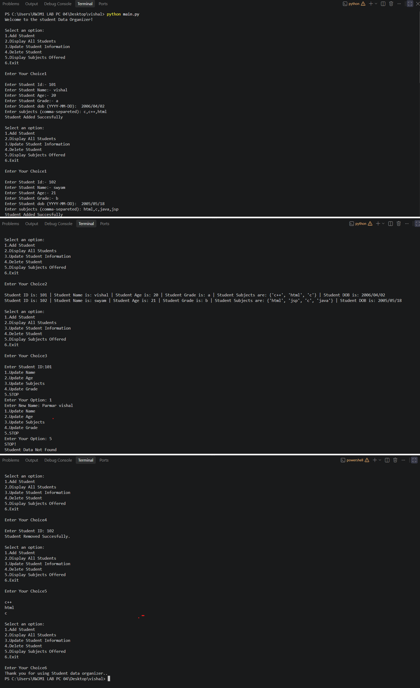

# 📚 Student Data Organizer

## 📌 Project Title

**Student Data Organizer**

## 📝 Project Description

The **Student Data Organizer** is a simple **Python console-based application** designed to manage student information easily.

The application allows users to **add, display, update, and delete student records**. It stores information such as **Student ID, Name, Age, Grade, Date of Birth, and Subjects**.

This project demonstrates the use of important Python data structures such as **List, Dictionary, Tuple, and Set** along with basic programming concepts like loops, conditions, input, and functions.

## ✨ Features

* ➕ **Add Student** – Add a new student's information.
* 👀 **Display All Students** – View all stored student records.
* ✏️ **Update Student Information** – Update name, age, subjects, or grade.
* 🗑️ **Delete Student** – Remove a student record using Student ID.
* 📚 **Display Subjects Offered** – Display all unique subjects offered.
* 🚪 **Exit** – Exit the application safely.
* 🔹 Uses **Set** to store unique subjects.
* 📦 Uses **Dictionary** to organize student information.
* 📋 Uses **List** to store multiple student records.
* 🔢 Uses **Tuple** to store Student ID and Date of Birth.

## 🛠️ Technologies Used

* 🐍 **Python** – Main programming language
* 💻 **VS Code** – Code editor and development environment
* 🔧 **Git** – Version control system
* 🌐 **GitHub** – Repository hosting and project sharing

## ▶️ How to Run / Installation

### 1. Install Python

Download and install **Python** on your computer.

Check whether Python is installed:

```bash
python --version
```

### 2. Open the Project

Open the project folder in **VS Code**.

### 3. Run the Program

Open the VS Code terminal and run:

```bash
python student_data_organizer.py
```

### 4. Use the Menu

After running the program, select an option from the menu:

```text
1. Add Student
2. Display All Students
3. Update Student Information
4. Delete Student
5. Display Subjects Offered
6. Exit
```

## 📂 Project Structure

```text

├── main.py
├── output.png
├── README.md

```

## output



## 👨‍💻 Author / Developer

**Developer Name:** Vishal Parmar
